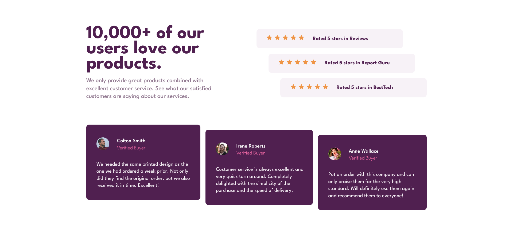

# Frontend Mentor - Social proof section solution

This is a solution to the [Social proof section challenge on Frontend Mentor](https://www.frontendmentor.io/challenges/social-proof-section-6e0qTv_bA). Frontend Mentor challenges help you improve your coding skills by building realistic projects.

## Table of contents

- [Overview](#overview)
  - [The challenge](#the-challenge)
  - [Screenshot](#screenshot)
  - [Links](#links)
- [My process](#my-process)
  - [Built with](#built-with)
  - [What I learned](#what-i-learned)
  - [Useful resources](#useful-resources)
- [Author](#author)

## Overview

### The challenge

Users should be able to:

- View the optimal layout for the section depending on their device's screen size

### Screenshot



### Links

- Solution URL: [https://github.com/adiah-frontend-mentor/social-proof](https://github.com/adiah-frontend-mentor/social-proof)
- Live Site URL: [https://adiah-frontend-mentor.github.io/social-proof/](https://adiah-frontend-mentor.github.io/social-proof/)

## My process

### Built with

- Semantic HTML5 markup
- CSS custom properties
- React
- SCSS
- Flexbox
- CSS Grid
- Mobile-first workflow

Created the boiler plate React code using `npx create-react-app`.
Then I cleaned up the boiler plate code.

Set up the react app to publish on github pages:

- add `homepage` to `package.json`
  ```json
  "homepage": "https://nathanieladiah.github.io/social-proof",
  ```
- Install `gh-pages`

  ```
  `npm install --save gh-pages`
  ```

- Add `predeploy` and `deploy` to scripts in `package.json`

  ```json
  "scripts": {
  	"predeploy": "npm run build",
  	"deploy": "gh-pages -d build",
  }
  ```

- then the site can be deployed with `npm run deploy`

- ensure the github pages is set to use `gh-pages` branch.

Determine the reusable components in the design, in this case the testimonial cards and the rating boxes.

I made custom components for each of them and imported to the base app.

Then I started creating the markup in the App component, calling the custom components and passing in props for the details.

```jsx
const ratingElements = ratingData.map((rating) => (
  <Rating rating={rating.rating} category={rating.category} />
));
```

Then I wrote the components to display the correct data.

Create a component for the star, with a prop of filled as a boolean.
So that I could do some sort of loop to have the correct number filled in according to the rating.

I'm thinking a loop like:

```
for rating
	<Star filled=true />
for 5 - rating
	<Star filled=false />
```

Use inline svg to change the fill value conditionally based on the filled prop.

Once all the props worked to load the correct data, style the app.

Using scss.

### What I learned

I created a loop to add star components based on the rating imported from the props

```jsx
for (let i = 0; i < rating; i++) {
  stars.push(<Star filled={true} key={i} />);
}

for (let i = 0; i < 5 - rating; i++) {
  stars.push(<Star filled={false} key={i + rating} />);
}
```

Then with the `filled` attribute passed as a prop, I was able to manipulate the fill of the star svg:

```jsx
<svg width="17" height="16" xmlns="http://www.w3.org/2000/svg">
  <path
    d="M16.539 6.097a.297.297 0 00-.24-.202l-5.36-.779L8.542.26a.296.296 0 00-.53 0L5.613 5.117l-5.36.779a.297.297 0 00-.165.505l3.88 3.78-.917 5.34a.297.297 0 00.43.312l4.795-2.52 4.794 2.52a.296.296 0 00.43-.313l-.916-5.338L16.464 6.4c.08-.08.11-.197.075-.304z"
    fill={filled ? "#EF9546" : "#DDDDDD"}
    fillRule="nonzero"
  />
</svg>
```

For the staggered appearance of the rating cards and testimonials I made use of flexbox and the align-self property:

```scss
@include abs.breakpoint(medium) {
  &:first-child {
    align-self: start;
  }

  &:nth-child(2) {
    align-self: center;
  }

  &:last-child {
    align-self: end;
  }
}
```

### Useful resources

- [CSS-Tricks: A Complete Guide to Grid](https://css-tricks.com/snippets/css/complete-guide-grid/) -
  This is a great resource for seeing all the CSS grid properties and options visually.

## Author

- Website - [Nathaniel Adiah](https://nathanieladiah.github.io)
- Frontend Mentor - [@nathanieladiah](https://www.frontendmentor.io/profile/nathanieladiah)
- Twitter - [@nathanieladiah](https://www.twitter.com/nathanieladiah)
